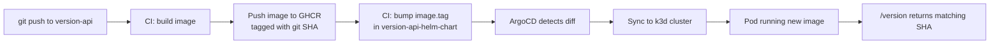

# version-api

A minimal FastAPI service built to demonstrate a complete GitOps deployment pipeline: GitHub Actions CI → GHCR → a separate Helm manifests repo → ArgoCD → a local Kubernetes cluster (k3d).

## What this demonstrates

- Multi-job CI in GitHub Actions, with explicit cross-job data passing
- Image build & push to GitHub Container Registry (GHCR), tagged by git SHA
- A strict GitOps split: CI never touches the cluster — it only ever writes to a separate manifests repo, and ArgoCD is the only thing that ever talks to the cluster
- ArgoCD continuous deployment over SSH
- Kubernetes Deployment with liveness/readiness probes
- Private image pulls secured with a Kubernetes `imagePullSecret`, generated and applied without the raw credential ever touching git or sitting in plaintext on disk
- Provable end-to-end correctness: the running pod reports the exact git SHA and build time that produced it

## Architecture



## Repos

- App code (this repo): `version-api`
- Deployment manifests (Helm chart): [`version-api-helm-chart`](https://github.com/saraassar/version-api-helm-chart)

Kept deliberately separate — CI's blast radius stays scoped to app code, and ArgoCD only ever watches deployment state, never source code.

## Endpoints

| Route | Purpose |
|---|---|
| `GET /healthz` | Liveness/readiness check |
| `GET /version` | Returns `git_sha` and `build_time`, baked into the image at build time via Docker build-args — never computed at runtime |

## Pipeline, step by step

1. Push to `main` triggers CI — only for changes under `app/`, `Dockerfile`, or `requirements.txt` (doc-only commits are filtered out)
2. **`build-and-push`** computes the short git SHA, builds the image with it baked in, pushes to `ghcr.io/saraassar/version-api:<sha>`
3. **`update-manifest`** checks out `version-api-helm-chart` with a scoped PAT, bumps `image.tag` to that same SHA via `yq`, commits as `ci-bot`, pushes
4. ArgoCD, watching that repo over SSH, detects the diff and syncs automatically
5. The new pod comes up in the `version-api` namespace, pulling the private image via an `imagePullSecret`
6. `/version` on the running pod reflects the exact commit that triggered the whole chain — the real proof the loop closed correctly, not just that something ran

## Design decisions (and problems solved building this)

- **Cross-job SHA passing** — `build-and-push` and `update-manifest` are isolated GitHub Actions jobs (separate VMs). The SHA is explicitly published via a job-level `outputs:` block; nothing is assumed to persist between them automatically.
- **Least-privilege cross-repo token** — CI's write access to the manifests repo uses a fine-grained PAT scoped to that single repository with `Contents: Read and write` only, not a broad classic token.
- **Secrets never touch git** — the GHCR pull secret is generated locally, gpg-encrypted at rest, and applied via `gpg --decrypt ... | kubectl apply -f -`, so the plaintext credential is never written to disk and never enters either repo.
- **Namespace consistency** — the pull secret, the Deployment, and the ArgoCD Application's `destination.namespace` all had to explicitly agree on `version-api`; Kubernetes has no cross-namespace secret lookup, so a mismatch here fails silently rather than with an obvious error.
- **CI path filtering** — the workflow only triggers on files that actually affect the built image, so README/doc changes don't burn a build-and-push cycle.

## Local development

```bash
docker build \
  --build-arg GIT_SHA=$(git rev-parse --short HEAD) \
  --build-arg BUILD_TIME=$(date -u +%Y-%m-%dT%H:%M:%SZ) \
  -t version-api:local .
docker run --rm -p 8000:8000 version-api:local
```
